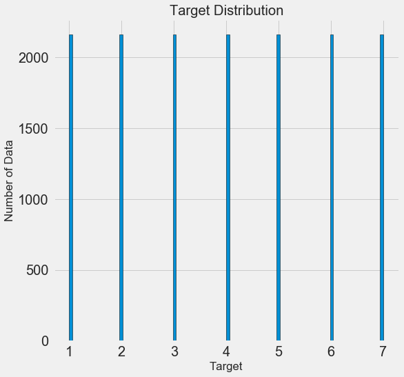
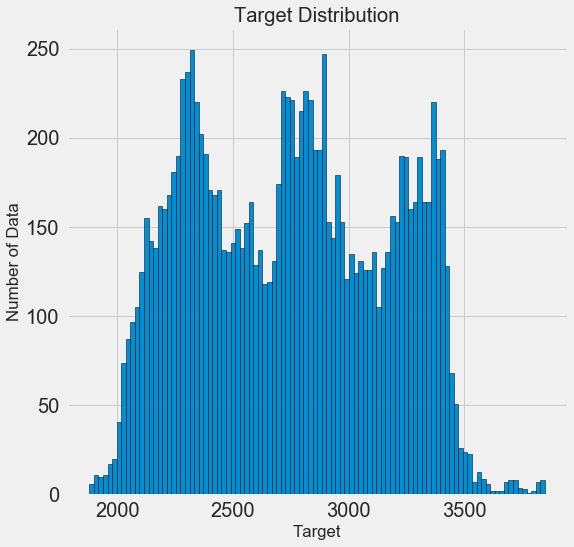

```python
# Pandas and numpy for data manipulation
import pandas as pd
import numpy as np
```


```python
# Matplotlib visualization
import matplotlib.pyplot as plt
%matplotlib inline

# Set default font size
plt.rcParams['font.size'] = 24

# Internal ipython tool for setting figure size
from IPython.core.pylabtools import figsize

# Seaborn for visualization
import seaborn as sns
sns.set(font_scale = 2)
```


```python
# Splitting data into training and testing
from sklearn.model_selection import train_test_split
```


```python
# Read in data into a dataframe 
data = pd.read_csv('train-missings.csv')

# Display top of dataframe
data.head()
```


<div>
<style>
    .dataframe thead tr:only-child th {
        text-align: right;
    }

    .dataframe thead th {
        text-align: left;
    }

    .dataframe tbody tr th {
        vertical-align: top;
    }
</style>
<table border="1" class="dataframe">
  <thead>
    <tr style="text-align: right;">
      <th></th>
      <th>Id</th>
      <th>p1</th>
      <th>p2</th>
      <th>p3</th>
      <th>p4</th>
      <th>p5</th>
      <th>p6</th>
      <th>p7</th>
      <th>p8</th>
      <th>p9</th>
      <th>p10</th>
      <th>p11</th>
      <th>p12</th>
      <th>p13</th>
      <th>target</th>
    </tr>
  </thead>
  <tbody>
    <tr>
      <th>0</th>
      <td>1</td>
      <td>2596.0</td>
      <td>NaN</td>
      <td>3.0</td>
      <td>NaN</td>
      <td>0.0</td>
      <td>NaN</td>
      <td>221.0</td>
      <td>232.0</td>
      <td>148.0</td>
      <td>6279.0</td>
      <td>1.0</td>
      <td>0.0</td>
      <td>0.0</td>
      <td>5</td>
    </tr>
    <tr>
      <th>1</th>
      <td>2</td>
      <td>2590.0</td>
      <td>56.0</td>
      <td>2.0</td>
      <td>212.0</td>
      <td>NaN</td>
      <td>390.0</td>
      <td>220.0</td>
      <td>NaN</td>
      <td>NaN</td>
      <td>6225.0</td>
      <td>1.0</td>
      <td>0.0</td>
      <td>0.0</td>
      <td>5</td>
    </tr>
    <tr>
      <th>2</th>
      <td>3</td>
      <td>2804.0</td>
      <td>NaN</td>
      <td>9.0</td>
      <td>268.0</td>
      <td>65.0</td>
      <td>3180.0</td>
      <td>NaN</td>
      <td>238.0</td>
      <td>NaN</td>
      <td>6121.0</td>
      <td>NaN</td>
      <td>0.0</td>
      <td>0.0</td>
      <td>2</td>
    </tr>
    <tr>
      <th>3</th>
      <td>4</td>
      <td>2785.0</td>
      <td>155.0</td>
      <td>18.0</td>
      <td>242.0</td>
      <td>118.0</td>
      <td>3090.0</td>
      <td>238.0</td>
      <td>238.0</td>
      <td>122.0</td>
      <td>6211.0</td>
      <td>1.0</td>
      <td>NaN</td>
      <td>0.0</td>
      <td>2</td>
    </tr>
    <tr>
      <th>4</th>
      <td>5</td>
      <td>2595.0</td>
      <td>45.0</td>
      <td>NaN</td>
      <td>153.0</td>
      <td>-1.0</td>
      <td>391.0</td>
      <td>220.0</td>
      <td>234.0</td>
      <td>150.0</td>
      <td>6172.0</td>
      <td>1.0</td>
      <td>0.0</td>
      <td>0.0</td>
      <td>5</td>
    </tr>
  </tbody>
</table>
</div>


```python
data.info()
```

    <class 'pandas.core.frame.DataFrame'>
    RangeIndex: 15120 entries, 0 to 15119
    Data columns (total 15 columns):
    Id        15120 non-null int64
    p1        12156 non-null float64
    p2        12188 non-null float64
    p3        12096 non-null float64
    p4        12071 non-null float64
    p5        12083 non-null float64
    p6        12057 non-null float64
    p7        12151 non-null float64
    p8        12035 non-null float64
    p9        12073 non-null float64
    p10       12152 non-null float64
    p11       12031 non-null float64
    p12       12031 non-null float64
    p13       12198 non-null float64
    target    15120 non-null int64
    dtypes: float64(13), int64(2)
    memory usage: 1.7 MB
    


```python
data=data.drop("Id",axis=1)
data.describe()
```


<div>
<style>
    .dataframe thead tr:only-child th {
        text-align: right;
    }

    .dataframe thead th {
        text-align: left;
    }

    .dataframe tbody tr th {
        vertical-align: top;
    }
</style>
<table border="1" class="dataframe">
  <thead>
    <tr style="text-align: right;">
      <th></th>
      <th>p1</th>
      <th>p2</th>
      <th>p3</th>
      <th>p4</th>
      <th>p5</th>
      <th>p6</th>
      <th>p7</th>
      <th>p8</th>
      <th>p9</th>
      <th>p10</th>
      <th>p11</th>
      <th>p12</th>
      <th>p13</th>
      <th>target</th>
    </tr>
  </thead>
  <tbody>
    <tr>
      <th>count</th>
      <td>12156.000000</td>
      <td>12188.000000</td>
      <td>12096.000000</td>
      <td>12071.000000</td>
      <td>12083.000000</td>
      <td>12057.000000</td>
      <td>12151.000000</td>
      <td>12035.000000</td>
      <td>12073.000000</td>
      <td>12152.000000</td>
      <td>12031.000000</td>
      <td>12031.000000</td>
      <td>12198.000000</td>
      <td>15120.000000</td>
    </tr>
    <tr>
      <th>mean</th>
      <td>2746.864676</td>
      <td>155.722432</td>
      <td>16.525132</td>
      <td>226.259796</td>
      <td>50.931226</td>
      <td>1704.409969</td>
      <td>212.594272</td>
      <td>219.061903</td>
      <td>135.032966</td>
      <td>1511.744651</td>
      <td>0.239631</td>
      <td>0.032250</td>
      <td>0.418675</td>
      <td>4.000000</td>
    </tr>
    <tr>
      <th>std</th>
      <td>417.908441</td>
      <td>109.820171</td>
      <td>8.459560</td>
      <td>208.777715</td>
      <td>61.161804</td>
      <td>1319.590597</td>
      <td>30.485857</td>
      <td>22.797792</td>
      <td>45.789227</td>
      <td>1098.104397</td>
      <td>0.426876</td>
      <td>0.176671</td>
      <td>0.493362</td>
      <td>2.000066</td>
    </tr>
    <tr>
      <th>min</th>
      <td>1879.000000</td>
      <td>0.000000</td>
      <td>0.000000</td>
      <td>0.000000</td>
      <td>-146.000000</td>
      <td>0.000000</td>
      <td>0.000000</td>
      <td>99.000000</td>
      <td>0.000000</td>
      <td>0.000000</td>
      <td>0.000000</td>
      <td>0.000000</td>
      <td>0.000000</td>
      <td>1.000000</td>
    </tr>
    <tr>
      <th>25%</th>
      <td>2371.000000</td>
      <td>64.000000</td>
      <td>10.000000</td>
      <td>67.000000</td>
      <td>5.000000</td>
      <td>755.000000</td>
      <td>196.000000</td>
      <td>207.000000</td>
      <td>106.000000</td>
      <td>726.000000</td>
      <td>0.000000</td>
      <td>0.000000</td>
      <td>0.000000</td>
      <td>2.000000</td>
    </tr>
    <tr>
      <th>50%</th>
      <td>2751.000000</td>
      <td>125.000000</td>
      <td>15.000000</td>
      <td>180.000000</td>
      <td>32.000000</td>
      <td>1307.000000</td>
      <td>220.000000</td>
      <td>223.000000</td>
      <td>138.000000</td>
      <td>1262.500000</td>
      <td>0.000000</td>
      <td>0.000000</td>
      <td>0.000000</td>
      <td>4.000000</td>
    </tr>
    <tr>
      <th>75%</th>
      <td>3101.000000</td>
      <td>259.000000</td>
      <td>22.000000</td>
      <td>324.000000</td>
      <td>79.000000</td>
      <td>2256.000000</td>
      <td>235.000000</td>
      <td>236.000000</td>
      <td>167.000000</td>
      <td>1989.000000</td>
      <td>0.000000</td>
      <td>0.000000</td>
      <td>1.000000</td>
      <td>6.000000</td>
    </tr>
    <tr>
      <th>max</th>
      <td>3849.000000</td>
      <td>360.000000</td>
      <td>52.000000</td>
      <td>1318.000000</td>
      <td>554.000000</td>
      <td>6890.000000</td>
      <td>254.000000</td>
      <td>254.000000</td>
      <td>248.000000</td>
      <td>6853.000000</td>
      <td>1.000000</td>
      <td>1.000000</td>
      <td>1.000000</td>
      <td>7.000000</td>
    </tr>
  </tbody>
</table>
</div>


```python
# Function to calculate missing values by column
def missing_values_table(df):
        # Total missing values
        mis_val = df.isnull().sum()
        
        # Percentage of missing values
        mis_val_percent = 100 * df.isnull().sum() / len(df)
        
        # Make a table with the results
        mis_val_table = pd.concat([mis_val, mis_val_percent], axis=1)
        
        # Rename the columns
        mis_val_table_ren_columns = mis_val_table.rename(
        columns = {0 : 'Missing Values', 1 : '% of Total Values'})
        
        # Sort the table by percentage of missing descending
        mis_val_table_ren_columns = mis_val_table_ren_columns[
            mis_val_table_ren_columns.iloc[:,1] != 0].sort_values(
        '% of Total Values', ascending=False).round(1)
        
        # Print some summary information
        print ("Your selected dataframe has " + str(df.shape[1]) + " columns.\n"      
            "There are " + str(mis_val_table_ren_columns.shape[0]) +
              " columns that have missing values.")
        
        # Return the dataframe with missing information
        return mis_val_table_ren_columns
```


```python
missing_values_table(data)
```

    Your selected dataframe has 14 columns.
    There are 13 columns that have missing values.
    


<div>
<style>
    .dataframe thead tr:only-child th {
        text-align: right;
    }

    .dataframe thead th {
        text-align: left;
    }

    .dataframe tbody tr th {
        vertical-align: top;
    }
</style>
<table border="1" class="dataframe">
  <thead>
    <tr style="text-align: right;">
      <th></th>
      <th>Missing Values</th>
      <th>% of Total Values</th>
    </tr>
  </thead>
  <tbody>
    <tr>
      <th>p11</th>
      <td>3089</td>
      <td>20.4</td>
    </tr>
    <tr>
      <th>p12</th>
      <td>3089</td>
      <td>20.4</td>
    </tr>
    <tr>
      <th>p8</th>
      <td>3085</td>
      <td>20.4</td>
    </tr>
    <tr>
      <th>p6</th>
      <td>3063</td>
      <td>20.3</td>
    </tr>
    <tr>
      <th>p4</th>
      <td>3049</td>
      <td>20.2</td>
    </tr>
    <tr>
      <th>p9</th>
      <td>3047</td>
      <td>20.2</td>
    </tr>
    <tr>
      <th>p5</th>
      <td>3037</td>
      <td>20.1</td>
    </tr>
    <tr>
      <th>p3</th>
      <td>3024</td>
      <td>20.0</td>
    </tr>
    <tr>
      <th>p7</th>
      <td>2969</td>
      <td>19.6</td>
    </tr>
    <tr>
      <th>p10</th>
      <td>2968</td>
      <td>19.6</td>
    </tr>
    <tr>
      <th>p1</th>
      <td>2964</td>
      <td>19.6</td>
    </tr>
    <tr>
      <th>p2</th>
      <td>2932</td>
      <td>19.4</td>
    </tr>
    <tr>
      <th>p13</th>
      <td>2922</td>
      <td>19.3</td>
    </tr>
  </tbody>
</table>
</div>


```python
figsize(8, 8)

# Histogram of the target
plt.style.use('fivethirtyeight')
plt.hist(data['target'].dropna(), bins = 100, edgecolor = 'k');
plt.xlabel('Target'); plt.ylabel('Number of Data'); 
plt.title('Target Distribution');
```





```python
plt.style.use('fivethirtyeight')
plt.hist(data['p1'].dropna(), bins = 100, edgecolor = 'k');
plt.xlabel('Target'); plt.ylabel('Number of Data'); 
plt.title('Target Distribution');

data['p1'].describe()
```


    count    12156.000000
    mean      2746.864676
    std        417.908441
    min       1879.000000
    25%       2371.000000
    50%       2751.000000
    75%       3101.000000
    max       3849.000000
    Name: p1, dtype: float64





```python
# cols=['p1','p2','p3','p4','p5','p6','p7','p8','p9','p10','p11','p12','p13']
# first_quartile=[0 for col in cols]
# third_quartile=[0 for col in cols]
# iqr=[0 for col in cols]

# for i in range(len(cols)):
#     # Calculate first and third quartile
#     first_quartile[i] = data[cols[i]].describe()['25%']
#     third_quartile[i] = data[cols[i]].describe()['75%']

#     # Interquartile range
#     iqr[i] = third_quartile[i] - first_quartile[i]
    
#     print('Delete','p%s'%(i+1),first_quartile[i] - 3 * iqr[i],third_quartile[i] + 3 * iqr[i])
    
#     # Remove outliers
#     data = data[(data[cols[i]] > (first_quartile[i] - 3 * iqr[i])) &
#                 (data[cols[i]] < (third_quartile[i] + 3 * iqr[i]))]
```


```python
# Find all correlations and sort 
correlations_data = data.corr()['target'].sort_values()

print(correlations_data, '\n')
```

    p11      -0.237316
    p6       -0.104968
    p8       -0.094755
    p10      -0.087357
    p9       -0.059910
    p7       -0.013471
    p4       -0.007298
    p12       0.007603
    p2        0.013291
    p1        0.018646
    p5        0.072837
    p3        0.084358
    p13       0.118785
    target    1.000000
    Name: target, dtype: float64 
    
    


```python
# Select the numeric columns
numeric_subset = data

# Create columns with square root and log of numeric columns
for col in numeric_subset.columns:
    # Skip the Energy Star Score column
    if col == 'target':
        next
    else:
        numeric_subset['sqrt_' + col] = np.sqrt(numeric_subset[col])
        numeric_subset['log_' + col] = np.log(numeric_subset[col])

# Select the categorical columns
categorical_subset = data[['p1', 'p2']]

# One hot encode
categorical_subset = pd.get_dummies(categorical_subset)

# Join the two dataframes using concat
# Make sure to use axis = 1 to perform a column bind
features = pd.concat([numeric_subset, categorical_subset], axis = 1)

# Drop buildings without an energy star score
features = features.dropna(subset = ['target'])

# Find correlations with the score 
correlations = features.corr()['target'].dropna().sort_values()
```

    C:\Users\Kourosh\Anaconda3\lib\site-packages\ipykernel_launcher.py:11: RuntimeWarning: divide by zero encountered in log
      # This is added back by InteractiveShellApp.init_path()
    C:\Users\Kourosh\Anaconda3\lib\site-packages\ipykernel_launcher.py:10: RuntimeWarning: invalid value encountered in sqrt
      # Remove the CWD from sys.path while we load stuff.
    C:\Users\Kourosh\Anaconda3\lib\site-packages\ipykernel_launcher.py:11: RuntimeWarning: invalid value encountered in log
      # This is added back by InteractiveShellApp.init_path()
    


```python
correlations
```


    sqrt_p11   -0.237316
    p11        -0.237316
    p6         -0.104968
    p8         -0.094755
    sqrt_p8    -0.094421
    log_p8     -0.093844
    p10        -0.087357
    sqrt_p6    -0.087323
    sqrt_p10   -0.072226
    log_p6     -0.066032
    sqrt_p9    -0.063897
    log_p9     -0.061268
    p9         -0.059910
    log_p10    -0.051907
    log_p4     -0.036798
    sqrt_p4    -0.031573
    sqrt_p7    -0.013626
    p7         -0.013471
    log_p7     -0.011837
    p4         -0.007298
    log_p1      0.000041
    log_p2      0.007169
    sqrt_p2     0.007491
    p12         0.007603
    sqrt_p12    0.007603
    sqrt_p1     0.009045
    p2          0.013291
    p2          0.013291
    p1          0.018646
    p1          0.018646
    sqrt_p5     0.048969
    log_p5      0.065723
    p5          0.072837
    p3          0.084358
    sqrt_p3     0.089375
    log_p3      0.090295
    p13         0.118785
    sqrt_p13    0.118785
    target      1.000000
    Name: target, dtype: float64


